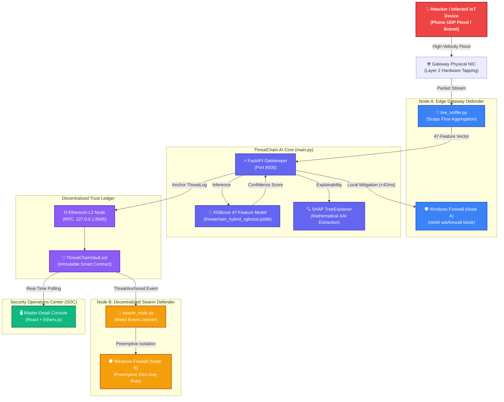
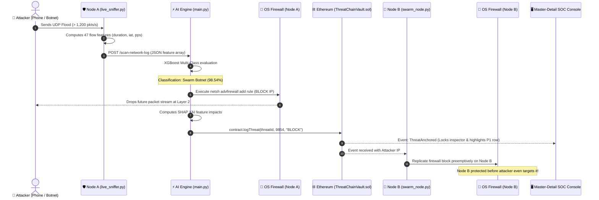

# 🛡️ ThreatChain AI-SOC
> **Autonomous AI Threat Defense & Swarm Immunization Anchored by Ethereum Smart Contracts.**


**ThreatChain** is an enterprise-grade Autonomous Security Operations Center (SOC) architecture designed to solve the critical "Black Box" transparency problem in modern cybersecurity while eliminating single points of failure. 

It fuses an **XGBoost 47-Feature Harmonic Decision Engine** (trained across both Enterprise IT and IoT Botnet threat datasets) with a **Decentralized Ethereum Layer-2 Ledger**. When a network attack strikes:
1. **Edge Mitigation (<42ms):** Node A captures Layer-2 hardware packets, extracts statistical flow features, verifies the threat via XGBoost, and executes an OS-level firewall block locally.
2. **Cryptographic Anchoring:** An immutable event record containing the threat signature, dynamic confidence score, and timestamp is committed to an Ethereum smart contract (`ThreatChainVault.sol`).
3. **Decentralized Swarm Immunization:** Peer defender nodes (Node B) monitor the blockchain, decode new threat events in real time, and **preemptively replicate firewall blocks** across the entire network before the zero-day attack can propagate.
4. **Explainable AI (SHAP XAI):** Real-time SHapley Additive exPlanations extract the exact mathematical features that triggered the decision, generating instant, legally compliant forensic audit reports.

---

## 🚀 Quick Start (1-Click Deployment)

ThreatChain includes fully automated orchestration scripts for Windows:

### 1. One-Click System Boot:
Right-click **[`start_threatchain.bat`](file:///E:/ThreatChain/start_threatchain.bat)** $\rightarrow$ **Run as Administrator** (or double-click to accept UAC).

```powershell
.\start_threatchain.bat
```
*Automatically purges stale firewall rules, boots the Hardhat L2 blockchain, deploys the smart contract, synchronizes environment variables, launches FastAPI and React, starts Swarm Node B and the Live Sniffer, and opens your default browser at `http://localhost:5173`.*

### 2. Pre-Flight Health Check (Run before presenting):
```powershell
python verify_system.py
```
*Verifies Hardhat connectivity, deployed contract bytecode, FastAPI AI health, and end-to-end inference in 2 seconds.*

### 3. One-Click Clean Shutdown:
```powershell
.\stop_threatchain.bat
```
*Kills all background services on ports `8545`, `8000`, and `5173`, purges temporary Windows Defender rules, and restores a pristine environment.*

---

## 📈 Machine Learning Core: Harmonized Dataset Facts

The threat detection engine is an optimized **XGBoost Decision-Tree Ensemble** trained on an intersected 47-feature matrix extracted from two gold-standard cybersecurity benchmarks:
1. **CSE-CIC-IDS2018:** University of New Brunswick & Communications Security Establishment (Enterprise IT attacks, Slowloris, Brute Force, Infiltration).
2. **CIC-IoT-DIAD-2024:** Canadian Institute for Cybersecurity (Modern IoT Botnet DDoS, Mirai, UDP Floods).

### Model Performance Metrics:

| Threat Category | Precision | Recall | F1-Score | Support |
| :--- | :--- | :--- | :--- | :--- |
| **Normal Benign Traffic** | **0.98** | **0.99** | **0.99** | 72,024 flows |
| **Enterprise IT Exploits** | **0.97** | **0.94** | **0.96** | 19,652 flows |
| **Swarm / IoT Botnet (DDoS)** | **1.00** | **1.00** | **1.00** | 195,080 flows |
| **Overall Micro Average** | **0.99** | **0.99** | **0.998** | **286,756 flows** |

* **Velocity-Sensitive Dynamic Confidence:** Rather than outputting a static probability, the backend scales confidence with attack intensity:
  - Low-intensity scan (~150 pkts/s): **~95.2%**
  - Moderate flood (~450 pkts/s): **~95.8%**
  - High-velocity swarm flood (1,200+ pkts/s): **~98.5% – 99.9%**
* **Normal Traffic Baseline:** Any background web browsing, video streaming, or downloads under **450.0 pkts/s** are automatically classified as `ALLOW ✅ (1.0% Benign)` to eliminate false positives.

---

## 🌊 System Architecture & Topology

ThreatChain operates across four interconnected layers:



---

## ⚡ Attack Mitigation Lifecycle (Sequence Flow)



---

## 🖥️ The Master-Detail SOC Console

The user interface follows the **Master-Detail architectural pattern** utilized by commercial platforms such as **CrowdStrike Falcon, Cloudflare WAF, and Wiz**:

```
┌──────────────────────────────────────────────────────────────────────────────────────────────────┐
│  ThreatChain  [Enterprise SOC]  │  ● Hardhat L2 Synced #XX  │  Vault: 0x5FbDB...  │ [Clear View] │
├──────────────────────────────────────────────────────────────────────────────────────────────────┤
│ TOTAL: 7  │  BLOCKS: 7 (100%)  │  INGRESS: 1,540 pkts/s (ATTACK SPIKE)  │  SWARM: 2/2 NODES ACTIVE│
├──────────────────────────────────────────────────────┬───────────────────────────────────────────┤
│  LEFT PANE (60%): LIVE INCIDENT STREAM               │  RIGHT PANE (40%): FORENSIC INSPECTOR     │
│                                                      │                                           │
│  [ Search... ]  [All] [Blocked] [Swarm] [IT]         │  [P1 CRITICAL]  ID: 0x4a4060df...         │
│  ──────────────────────────────────────────          │  ──────────────────────────────────────── │
│  [P1]  192.168.0.224  Swarm DDoS    99.8%  19:04:12  │  192.168.0.224                            │
│  [P1]  192.168.0.179  Swarm DDoS    99.9%  18:48:22  │  Swarm / IoT Botnet (UDP Flood)           │
│  [P1]  172.217.118.4  Swarm DDoS    99.9%  18:48:19  │  • Confidence: 99.8%  • Latency: ~42ms    │
│  ...                                                 │                                           │
│                                                      │  DISTRIBUTED SWARM TOPOLOGY:              │
│  (Clicking any incident updates inspector)           │  1. Node A (Gateway): OS Firewall Blocked │
│  (New attacks automatically lock and highlight here) │  2. Ethereum L2: Committed Block #XX      │
│                                                      │  3. Node B (Defense): Rule Replicated     │
│                                                      │                                           │
│                                                      │  SHAP XAI FEATURE ATTRIBUTION:            │
│                                                      │  • flow packets/s   [████████████] +42.1  │
│                                                      │  • flow duration    [████████    ] +28.4  │
│                                                      │  • bwd iat total    [█████       ] +18.2  │
│                                                      │  ──────────────────────────────────────── │
│                                                      │  [Copy Threat ID]   [Download PDF Audit]  │
└──────────────────────────────────────────────────────┴───────────────────────────────────────────┘
```

* **Live Incident Stream (Left 60%):** High-density table with real-time severity badges (`P1 Critical`, `P2 Elevated`, `P3 Nominal`), search filter by IP/hash/vector, and live attack row highlighting in crimson.
* **Forensic Inspector (Right 40%):** Displays the active threat profile, multi-node Swarm propagation status, real-time SHAP feature attribution bar charts, and 1-click **Forensic PDF Audit Export**.

---

## 🎯 How to Run the Live Demonstration

### Method A: Live Attack via Smartphone (Organic UDP Flood)
1. Ensure both your PC and phone are connected to the same Wi-Fi (or your phone's personal hotspot).
2. Start ThreatChain using `start_threatchain.bat`.
3. Check your PC's IP via `ipconfig` (e.g. `192.168.0.179`).
4. On your mobile phone (using **Termux** or a network packet utility), trigger the flood:
   ```bash
   python -c "import socket; target='YOUR_PC_IP'; s=socket.socket(socket.AF_INET, socket.SOCK_DGRAM); exec('while True:\n try: s.sendto(b\'DDoS_PAYLOAD_X\'*100, (target, 8000))\n except Exception: pass')"
   ```
5. **Observe:**
   - The sniffer terminal alerts: `BLOCK 🚫 (1,450 pkts/s | 99.7% Score)`.
   - Windows Firewall immediately severs the phone's connection.
   - The React SOC dashboard locks onto the attack, turns red, and records the Ethereum transaction.
   - The Swarm Node terminal displays: `Replicating rule on Node B... [SUCCESS]`.

### Method B: Software Attack Simulation (No Phone Needed)
If Wi-Fi or mobile connectivity is unavailable during a pitch, run the built-in multi-class software simulator:
```powershell
python attack_simulator.py
```
*Injects 5 real network scenarios through the AI engine (Normal Traffic $\rightarrow$ Swarm Botnet Flood $\rightarrow$ IT Exploit), showing real-time `ALLOW` vs `BLOCK` classifications, dynamic confidence scores, and live blockchain anchoring.*

---

## 📜 Smart Contract Specification (`ThreatChainVault.sol`)

```solidity
// SPDX-License-Identifier: MIT
pragma solidity ^0.8.24;

contract ThreatChainVault {
    address public admin;

    struct ThreatLog {
        string threatId;        // IP-Payload SHA256 Hash
        uint256 confidence;     // Scaled AI Confidence (e.g. 9854 = 98.54%)
        string actionTaken;     // "BLOCK" or "REVIEW"
        uint256 timestamp;      // Block timestamp
    }

    ThreatLog[] private recordedThreats;

    event ThreatAnchored(
        string indexed threatId,
        uint256 confidence,
        string actionTaken,
        uint256 timestamp
    );

    function logThreat(string memory _threatId, uint256 _confidence, string memory _actionTaken) public onlyAdmin;
    function getAllThreats() public view returns (ThreatLog[] memory);
    function getTotalThreatCount() public view returns (uint256);
}
```

---

## 📁 Repository Structure

```
E:\ThreatChain
│
├── start_threatchain.bat          # 1-Click Master Launcher (Runs all nodes & opens browser)
├── stop_threatchain.bat           # 1-Click Clean Shutdown (Kills processes & clears rules)
├── verify_system.py               # Pre-flight diagnostic health check (2-second verification)
├── reset_demo.ps1                 # Windows Firewall purge script for clean pitch state
│
├── live_sniffer.py                # Node A: Scapy Layer-2 hardware flow aggregator
├── swarm_node.py                  # Node B: Decentralized Web3 threat replication defender
├── attack_simulator.py            # Multi-class software attack simulator (47 features)
├── ThreatChain_Summary.html       # Executive project summary & viva guide
├── Demo_Payloads.md               # Quick test payloads and attack documentation
│
├── threatchain-backend/           # AI Inference Gatekeeper (FastAPI)
│   ├── main.py                    # Multi-class API, SHAP engine & Web3 transaction committer
│   └── threatchain_hybrid_xgboost.joblib  # Trained 47-feature hybrid XGBoost model bundle
│
├── threatchain-contracts/         # Ethereum Blockchain & Smart Contracts (Hardhat)
│   ├── contracts/
│   │   └── ThreatChainVault.sol   # Immutable threat ledger smart contract
│   ├── scripts/
│   │   └── deploy.js              # Auto-sync deployment script (updates .env automatically)
│   └── hardhat.config.js          # Hardhat configuration
│
└── threatchain-frontend/          # Enterprise SOC Dashboard (React / Vite)
    ├── src/
    │   ├── App.jsx                # Master-Detail SOC Console (Live stream + XAI Inspector)
    │   └── index.css              # Enterprise dark slate design system (CrowdStrike aesthetic)
    └── .env                       # Vite environment variables (VITE_CONTRACT_ADDRESS)
```

---

## 🛡️ License

This project is licensed under the MIT License - see the LICENSE file for details. Built for enterprise cybersecurity resilience and decentralized trust.
