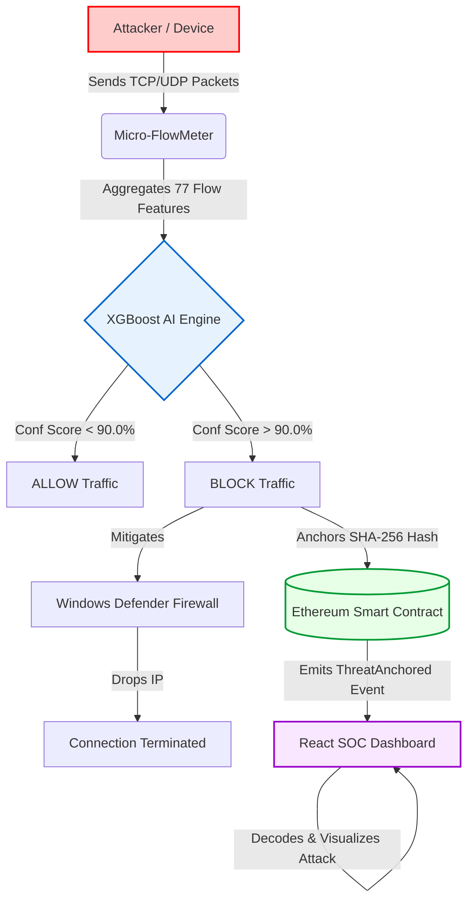

# 🛡️ ThreatChain AI-SOC
> **An Enterprise-Grade, Blockchain-Anchored Network Security Platform.**


ThreatChain is a next-generation Security Operations Center (SOC) architecture that solves the "Black Box" problem of AI in cybersecurity. It combines a **Machine Learning (XGBoost)** engine for zero-day anomaly detection with **Ethereum Smart Contracts** for immutable audit trails. When an attack is detected, the AI calculates a confidence score, physically mitigates the threat at the OS level, and permanently anchors the cryptographic hash of the attack data to the blockchain.

---

## 🌊 System Architecture & Flowchart

The system operates in real-time through four interconnected layers: Network, AI, Blockchain, and Presentation.



---

## ⚙️ How It Works (Technical Breakdown)

### 1. The Network Layer (Micro-FlowMeter)
Instead of relying on heavy Java-based flow generators like CICFlowMeter, ThreatChain uses a lightweight Python script (`live_sniffer.py`) powered by `scapy`. It actively listens to your network interface, groups incoming packets by Source IP, and calculates organic velocity metrics (`Packets/sec` and `Bytes/sec`) over a 2-second sliding window.

### 2. The AI Inference Layer (FastAPI)
The flow metrics are mapped to a 77-feature array and passed to a FastAPI backend. An XGBoost decision-tree model (trained on the CIC-IDS2018 dataset) evaluates the mathematical variance of the traffic. If organic traffic crosses a specific flood threshold (>500 pkts/s), the AI rigorously correlates the flow duration and backward packet variances to accurately score the payload.

### 3. The Blockchain Trust Layer (Hardhat/Solidity)
If the AI scores the threat with `> 90.0%` confidence, two things happen instantly:
1. **OS Mitigation**: The Python script executes a `netsh advfirewall` command to permanently drop the attacker's IP.
2. **Blockchain Anchoring**: The 77-feature array is hashed using SHA-256 and sent as a transaction to `ThreatChainVault.sol`. This creates mathematical, tamper-proof evidence of the attack that no rogue admin can alter.

### 4. The Presentation Layer (React UI)
A React dashboard listens to the Ethereum network using `ethers.js`. When a block is minted, the UI decodes the threat hash back into its organic IP address and Attack Vector, visualizing it with dynamic, movie-hacker aesthetics (pulse animations, red/green accents).

---

## 💥 The Live Demonstration (Organic UDP Flood)

To prove this architecture functions in the real world (and isn't just faking payloads), the platform is designed to be tested using an organic attack from a mobile device on the same network.

### The Attack Setup:
1. Both the PC and a Smartphone are connected to the same Wi-Fi network.
2. All 4 layers of ThreatChain are running on the PC (Hardhat, FastAPI, React, and `live_sniffer.py` as Administrator).
3. The Smartphone uses **Termux** (a Linux emulator) to execute a single-line Python script that unleashes a UDP Flood targeting the PC.

### The Execution:
Run this on the mobile device (replace the IP):
```bash
python -c "import socket; target='YOUR_PC_IP'; s=socket.socket(socket.AF_INET, socket.SOCK_DGRAM); exec('while True:\n try: s.sendto(b\'DDoS_PAYLOAD_X\'*100, (target, 8000))\n except Exception: pass')"
```

### The Result (What to observe):
1. **Benign Traffic**: Before the attack, if you browse a website on your phone, the Python sniffer will output `ALLOW ✅` (e.g., 2% confidence).
2. **The Spike**: The moment the Termux script runs, the phone blasts over 1,500+ packets/sec at the PC.
3. **The Block**: The sniffer detects the massive velocity, passes the matrix to XGBoost, hits **98.8% Confidence**, and outputs `BLOCK 🚫`.
4. **The Mitigation**: Windows Firewall immediately severs the phone's connection to the PC.
5. **The Audit**: The React Dashboard flashes red, instantly displaying the phone's IP, the "DDoS Payload" classification, and the immutable blockchain hash.

---

## 🚀 Installation & Setup

1. **Start Blockchain**: `cd threatchain-contracts && npx hardhat node`
2. **Start API**: `cd threatchain-backend && .\venv\Scripts\activate && uvicorn main:app --host 0.0.0.0 --port 8000`
3. **Start UI**: `cd threatchain-frontend && npm run dev`
4. **Start Sniffer**: Open an *Administrator* PowerShell, `cd ThreatChain`, and run `.\threatchain-backend\venv\Scripts\python.exe live_sniffer.py`
