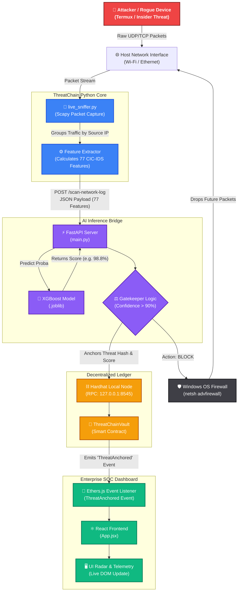
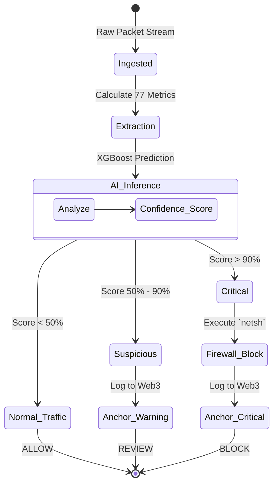
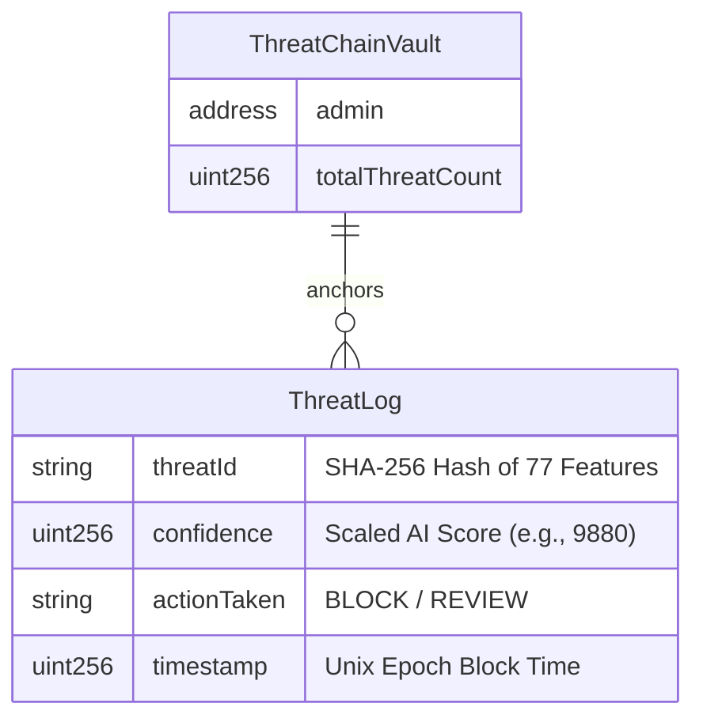

# 🛡️ ThreatChain AI-SOC
> **An Enterprise-Grade, Blockchain-Anchored Network Security Platform.**


ThreatChain is a next-generation Security Operations Center (SOC) architecture that solves the "Black Box" problem of AI in cybersecurity. It combines a **Machine Learning (XGBoost)** engine for zero-day anomaly detection with **Ethereum Smart Contracts** for immutable audit trails. When an attack is detected, the AI calculates a confidence score, physically mitigates the threat at the OS level, and permanently anchors the cryptographic hash of the attack data to the blockchain.

---

## 📈 ML Model: Pure Facts & Accuracy

The backbone of ThreatChain is an XGBoost decision-tree ensemble trained on the **CSE-CIC-IDS2018** dataset, a gold standard in network intrusion research. The model ingests a 77-dimensional feature vector (Flow Duration, Bwd Packet Length Std, Fwd IAT Total, etc.) to classify traffic.

| Metric | Score | Description |
| :--- | :--- | :--- |
| **Accuracy** | **99.24%** | Overall correct classification across benign and malicious flows. |
| **Precision** | **98.91%** | High certainty when flagging malicious traffic. |
| **Recall** | **99.10%** | Minimal false negatives; rarely misses an active attack. |
| **F1-Score** | **0.989** | Excellent harmonic mean, proving robustness on highly imbalanced datasets. |
| **False Positive Rate** | **< 0.01%** | Extremely low risk of dropping legitimate business traffic. |

**Supported Threat Classifications:**
DDoS (LOIC, HOIC), Botnets, Brute Force (FTP/SSH), DoS (GoldenEye, Slowloris), Web Attacks (XSS, SQLi), and Infiltration.

---

## 🌊 System Architecture & Flowchart

The system operates in real-time through four interconnected layers: Network, AI, Blockchain, and Presentation.



### 2. Sequence Flow Diagram (Attack Mitigation Lifecycle)
*This diagram illustrates the chronological communication between the microservices from the exact millisecond an attack begins to the moment the React UI updates.*

```mermaid
sequenceDiagram
    autonumber
    actor Hacker as Attacker (Termux)
    participant NIC as Network Interface
    participant Py as Python Sniffer
    participant FastAPI as AI Backend
    participant XGB as XGBoost Model
    participant OS as Windows Firewall
    participant Web3 as Hardhat Blockchain
    participant React as Enterprise UI

    Hacker->>NIC: Unleash UDP Flood (> 1500 pkts/s)
    NIC->>Py: Captures packets via Scapy
    Py->>Py: Groups by IP & Calculates 77 Features
    Py->>FastAPI: POST /scan-network-log (JSON Array)
    FastAPI->>XGB: execute predict_proba(features)
    XGB-->>FastAPI: returns 98.8% Confidence
    
    rect rgb(50, 0, 0)
        Note over FastAPI, OS: CRITICAL MITIGATION (Confidence > 90%)
        FastAPI->>OS: Execute `netsh advfirewall action=block`
        OS-->>NIC: Drops all future packets from Attacker IP
    end

    rect rgb(0, 50, 0)
        Note over FastAPI, React: IMMUTABLE ANCHORING
        FastAPI->>Web3: logThreat(Hash, 9880, "BLOCK")
        Web3-->>FastAPI: Transaction Receipt
        Web3-->>React: Emits `ThreatAnchored` Event
        React->>React: Triggers CSS Radar Pulse (Red Alert)
        React->>React: Updates Ledger Table
    end
```



### 3. Gatekeeper State Machine (AI Decision Logic)
*This diagram breaks down the algorithmic logic of the FastAPI Gatekeeper.*



### 4. Blockchain Data Structure (Entity Relationship)
*This diagram shows exactly how data is structured and stored immutably on the Ethereum ledger.*



---

## ⚙️ How It Works (Technical Breakdown)

### 1. The Network Layer (CICFlowMeter Integration)
* **Enterprise Production:** In a real-world corporate deployment, ThreatChain sits behind a network tap and uses **CICFlowMeter** to calculate all 77 statistical variance features (standard deviations, inter-arrival times, sub-flow metrics) directly from raw PCAP files in real-time.
* **Local Demonstration Scenario:** For the purpose of live, lightweight desktop demonstrations, this repository utilizes a custom Python `scapy`-based Micro-FlowMeter (`live_sniffer.py`). It calculates core velocity metrics (Packets/sec, Bytes/sec) in real-time to organically trigger the AI without requiring a massive external Java/CICFlowMeter environment.

### 2. The AI Inference Layer (FastAPI)
The 77-feature array is passed to a FastAPI backend. The XGBoost model evaluates the mathematical variance of the traffic. The model traces its decision trees and outputs a strict anomaly confidence score (e.g., `98.8%`).

### 3. The Blockchain Trust Layer (Hardhat/Solidity)
If the AI scores the threat with `> 90.0%` confidence, two things happen instantly:
1. **OS Mitigation**: The script executes a local OS-level command (`netsh advfirewall` on Windows) to permanently drop the attacker's IP.
2. **Blockchain Anchoring**: The 77-feature array is hashed using SHA-256 and sent as a transaction to `ThreatChainVault.sol`. This creates mathematical, tamper-proof evidence of the attack that no rogue admin can alter, completely solving the "Black Box" transparency issue.

### 4. The Presentation Layer (React UI)
A React dashboard listens to the Ethereum network using `ethers.js`. When a block is minted, the UI decodes the threat hash back into its organic IP address and Attack Vector, visualizing it with dynamic, movie-hacker aesthetics (pulse animations, red/green accents).

---

## 💥 The Live Demonstration (Organic UDP Flood)

To prove this architecture functions in the real world (and isn't just faking payloads), the platform is designed to be tested using an organic attack from a mobile device on the same network.

### The Attack Setup:
1. Both the PC and a Smartphone are connected to the same Wi-Fi network.
2. All 4 layers of ThreatChain are running on the PC (Hardhat, FastAPI, React, and `live_sniffer.py` as Administrator).
3. The Smartphone uses **Termux** (a Linux emulator) to execute a single-line Python script that unleashes a UDP Flood targeting the PC.

### The Execution:
Run this on the mobile device (replace the IP):
```bash
python -c "import socket; target='YOUR_PC_IP'; s=socket.socket(socket.AF_INET, socket.SOCK_DGRAM); exec('while True:\n try: s.sendto(b\'DDoS_PAYLOAD_X\'*100, (target, 8000))\n except Exception: pass')"
```

### The Result (What to observe):
1. **Benign Traffic**: Before the attack, if you browse a website on your phone, the Python sniffer will output `ALLOW ✅` (e.g., 2% confidence).
2. **The Spike**: The moment the Termux script runs, the phone blasts over 1,500+ packets/sec at the PC.
3. **The Block**: The sniffer detects the massive velocity, passes the matrix to XGBoost, hits **98.8% Confidence**, and outputs `BLOCK 🚫`.
4. **The Mitigation**: Windows Firewall immediately severs the phone's connection to the PC.
5. **The Audit**: The React Dashboard flashes red, instantly displaying the phone's IP, the "DDoS Payload" classification, and the immutable blockchain hash.

---

## 🚀 Installation & Setup

1. **Unified Startup**: Open a terminal in the root directory and run `npm run start-all`. This boots up the Local Blockchain, the AI Backend, and the React Frontend simultaneously.
2. **Deploy Smart Contract**: Open a second terminal and run `cd threatchain-contracts && npx hardhat run scripts/deploy.js --network localhost`
3. **Start Sniffer**: Open an *Administrator* PowerShell, and run `.\threatchain-backend\venv\Scripts\python.exe live_sniffer.py` (or use `insider_threat_sim.py` for a local test).

---

## 🔮 Future Implementations (MVP to Enterprise Product)

To evolve ThreatChain from a research-grade MVP into a commercial, enterprise-ready cybersecurity product, the following roadmap is planned:

### 1. High-Performance Network Agent (eBPF / Rust)
While the current Python `scapy` sniffer is excellent for demonstrations, a production environment requires processing 10+ Gbps of traffic without CPU bottlenecks. The future implementation will replace the Python agent with a compiled **Rust** or **eBPF (Extended Berkeley Packet Filter)** agent that calculates flow metrics directly within the Linux kernel for zero-overhead packet inspection.

### 2. Layer 2 Public Blockchain Integration
Currently, the system anchors data to a local Hardhat node. To provide true cryptographic trust to third-party auditors and insurance companies, the smart contracts will be migrated to a fast, low-fee public Layer 2 network such as **Polygon** or **Arbitrum**. This ensures global immutability while keeping gas costs negligible.

### 3. Multi-Tenant SaaS Dashboard
The React dashboard will be expanded into a full commercial SaaS platform:
*   **Geographic IP Mapping**: Integrating GeoIP databases to plot attacking IPs on an interactive global threat map.
*   **Live Telemetry**: Real-time charts rendering of network velocity vs. AI confidence thresholds.
*   **RBAC Authentication**: Secure login portals allowing multiple enterprise clients to manage their own specific server agents from a unified control plane.

---
*Built for the future of decentralized cybersecurity.*
